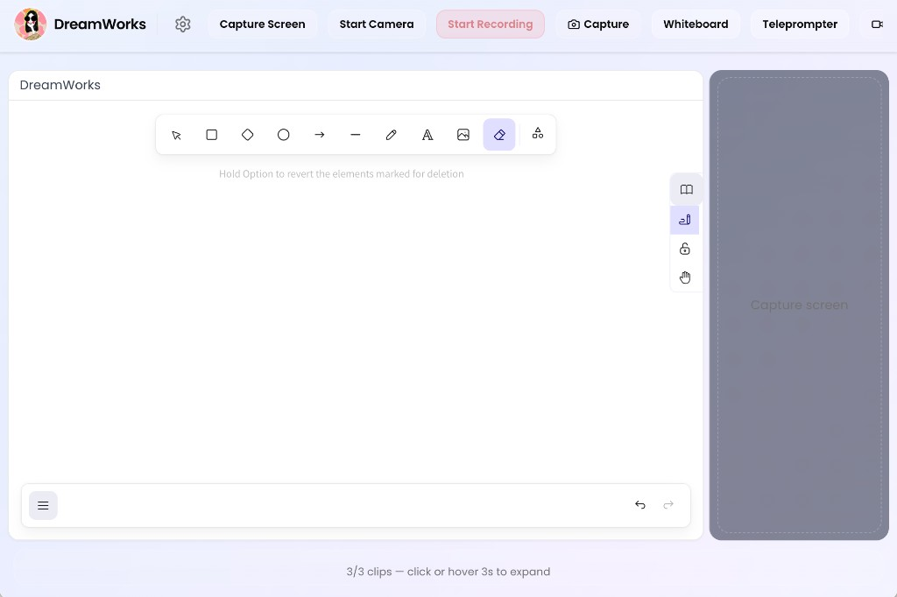
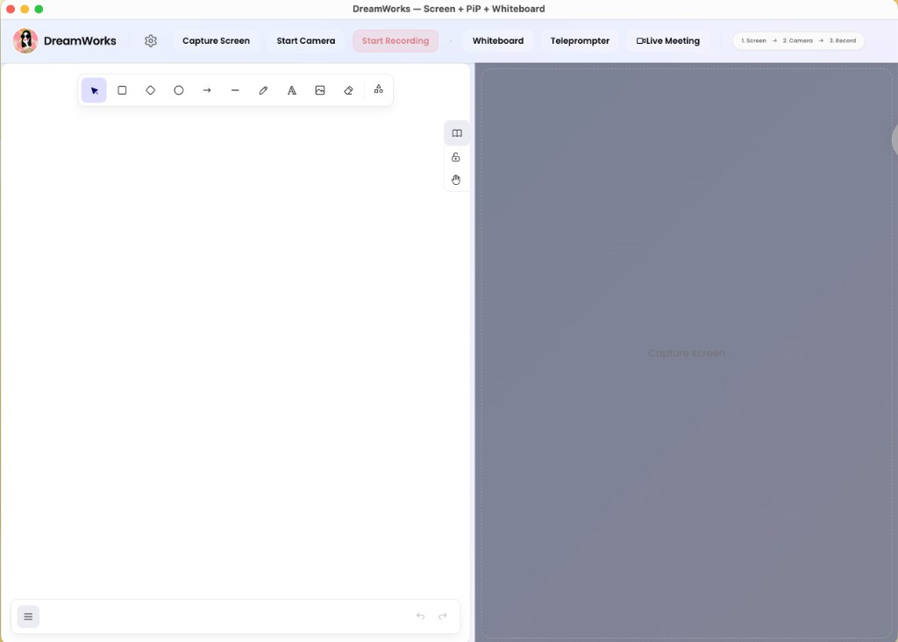
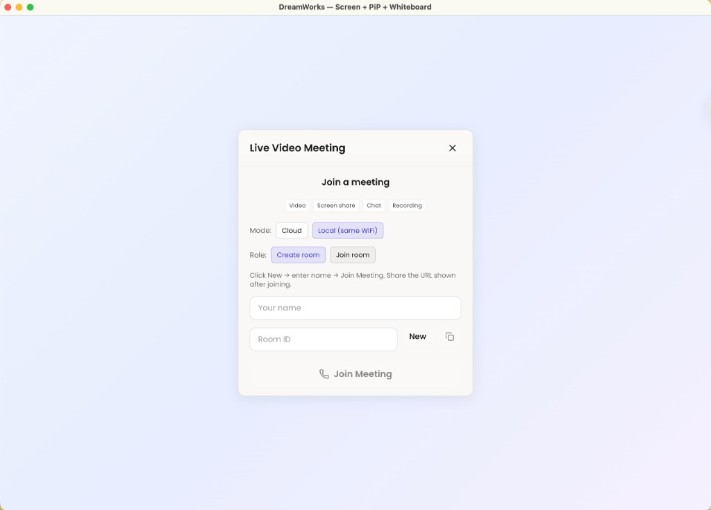
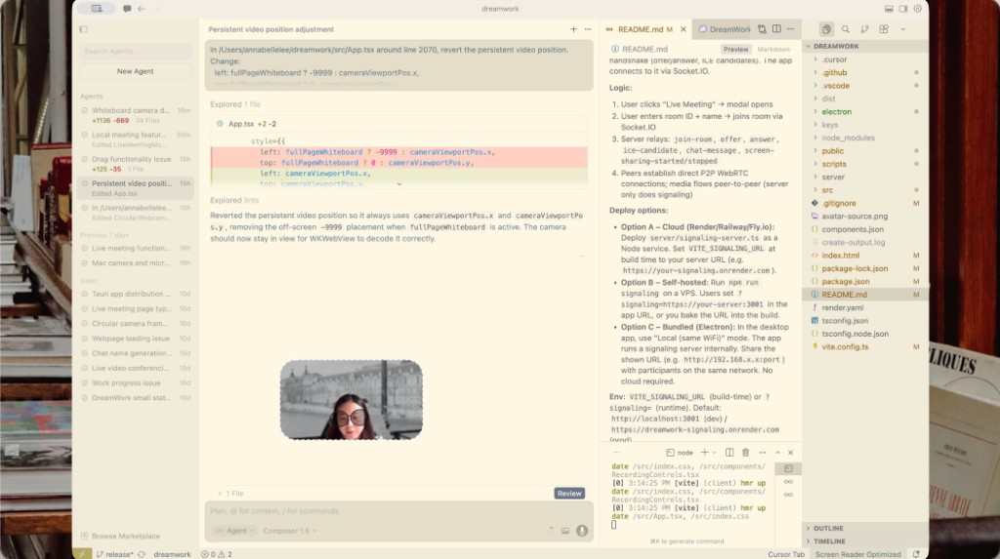

# DreamWorks

> Lightweight screen recorder with circular webcam PiP, whiteboard, and live meeting. Built with Electron + React.  
> 轻量级录屏 + 圆形摄像头画中画 + 白板 + 在线会议。基于 Electron + React 构建。



---

## 中文

### 我们为什么要做这个软件

在远程协作和内容创作中，我们常常需要同时展示屏幕、摄像头和手绘思路，但现有工具要么功能割裂，要么体积臃肿、体验卡顿。**DreamWorks** 希望把录屏、画中画、白板和在线会议整合进一个应用，让演示和会议更顺畅、更专注。

**DreamWorks 能帮你：**

- 一键录屏 + 摄像头画中画，无需切换多个软件
- 用白板实时画图、标注，配合屏幕共享讲清楚想法
- 在**同一局域网**内发起免费会议，无需依赖云服务
- 导出 WebM / MP4，方便分享和存档

### 核心优势

**丝滑体验**

- 界面简洁，操作路径短：屏幕 → 摄像头 → 录制，三步即可开始
- 白板、录屏、会议在同一窗口内切换，减少打断感
- 圆形画中画可拖拽定位，适配不同演示场景

**Mac 系统兼容性**

DreamWorks 基于 **Electron 33** 构建，支持以下 macOS 版本：


| 系统版本                       | 支持情况  |
| -------------------------- | ----- |
| **macOS 11 (Big Sur)**     | ✅ 支持  |
| **macOS 12 (Monterey)**    | ✅ 支持  |
| **macOS 13 (Ventura)**     | ✅ 支持  |
| **macOS 14 (Sonoma)**      | ✅ 支持  |
| **macOS 15 (Sequoia)**     | ✅ 支持  |
| macOS 10.15 (Catalina) 及更早 | ❌ 不支持 |


支持 **Intel** 与 **Apple Silicon (M1/M2/M3)** 架构。

### 功能概览

1. **Capture Screen** — 系统选择器选择屏幕、窗口或应用
2. **Start Camera** — 圆形画中画，可拖拽调整位置
3. **Whiteboard** — Excalidraw 白板，支持绘图、标注
4. **Live Meeting** — WebRTC 视频会议，支持聊天、屏幕共享、录制、虚拟背景、实时转录
5. **Record** — 录制屏幕 + 摄像头合成画面，支持保存 WebM / MP4

### 本地使用指南

**环境要求**：Node.js 18+，npm 或 yarn

**安装与运行：**

```bash
git clone https://github.com/Funghi88/DreamWorks.git
cd DreamWorks
npm install
npm run dev
```

应用会在 Electron 窗口中打开。

**仅 Web 模式（无 Electron）：** `npm run dev:web`，然后访问 [http://localhost:5173](http://localhost:5173)

**Live Meeting：** 终端 1 运行 `npm run signaling`，终端 2 运行 `npm run dev`。多用户测试可在浏览器中打开 2+ 标签页访问 [http://localhost:5173](http://localhost:5173)

**构建 macOS 应用：**
- `npm run pack` — 生成 `.app`，输出至 `release/mac-arm64/DreamWorks.app`（可直接双击运行）
- `npm run dist` — 生成 `.dmg` 和 `.zip` 安装包，输出至 `release/`

### 截图

| 主界面 | Live Meeting | 录制与导出 |
|--------|--------------|------------|
|  |  |  |
| 录屏 + 画中画 + 白板 | 视频会议界面（Local 模式） | 录制控制与导出 |


### 项目进展

**Live Meeting 功能状态：** 加入/创建房间 ✅、音视频通话 ✅、屏幕共享 ✅、文字聊天 ✅、会议内录制 ✅、虚拟背景 ✅、实时转录 ✅、**局域网模式（同一 Wi-Fi 免费会议）** ✅（Electron 内置信令）

### 未来规划

**核心方向：局域网免费会议** — 在同一局域网下（如不同办公楼但同一 Wi-Fi）实现完全免费的线上会议。Electron 内置信令服务，主机创建房间后分享地址，参与者通过局域网地址加入。无需云服务器、无订阅费用、低延迟、数据不出内网。

**其他规划：** 白板与会议协作整合、录制导出优化、Windows/Linux 支持。

### 故障排除

**Capture Screen 在 macOS 上无效：** 开发时在 **系统设置 → 隐私与安全性 → 屏幕录制** 中为 **Electron** 授权；打包应用则为 **DreamWorks** 授权。

---

### Why We Built DreamWorks

Remote collaboration and content creation often require showing your screen, camera, and hand-drawn ideas at once. Most tools either split these into separate apps or feel heavy and sluggish. **DreamWorks** brings screen capture, PiP webcam, whiteboard, and live meeting into one app—so you can present and meet without juggling windows.

**What DreamWorks does for you:**

- One-click screen recording with circular webcam overlay—no app switching
- Real-time whiteboard for sketching and annotating alongside screen share
- **Free meetings over the same LAN**—no cloud dependency
- Export to WebM or MP4 for sharing and archiving

### Core Advantages

**Smooth experience**

- Minimal UI with a short flow: Screen → Camera → Record
- Whiteboard, recording, and meeting live in one window—fewer context switches
- Draggable circular PiP that fits any layout

**macOS compatibility**

DreamWorks is built on **Electron 33** and supports:


| macOS version                      | Support |
| ---------------------------------- | ------- |
| **macOS 11 (Big Sur)**             | ✅       |
| **macOS 12 (Monterey)**            | ✅       |
| **macOS 13 (Ventura)**             | ✅       |
| **macOS 14 (Sonoma)**              | ✅       |
| **macOS 15 (Sequoia)**             | ✅       |
| macOS 10.15 (Catalina) and earlier | ❌       |


Both **Intel** and **Apple Silicon (M1/M2/M3)** are supported.

### Features

1. **Capture Screen** — System picker for screen, window, or app
2. **Start Camera** — Circular PiP, draggable
3. **Whiteboard** — Excalidraw overlay for drawing and annotation
4. **Live Meeting** — WebRTC video calls with chat, screen share, recording, virtual backgrounds, live transcription
5. **Record** — Composite screen + webcam; save as WebM or MP4

### Local setup

**Requirements:** Node.js 18+, npm or yarn

**Install and run:**

```bash
git clone https://github.com/Funghi88/DreamWorks.git
cd DreamWorks
npm install
npm run dev
```

The app opens in an Electron window.

**Web-only (no Electron):** Run `npm run dev:web`, then open [http://localhost:5173](http://localhost:5173)

**Live Meeting:** Terminal 1: `npm run signaling`. Terminal 2: `npm run dev`. For multi-user testing, open 2+ browser tabs at [http://localhost:5173](http://localhost:5173)

**Build for macOS:**
- `npm run pack` — Produces `.app` in `release/mac-arm64/DreamWorks.app` (double-click to run)
- `npm run dist` — Produces `.dmg` and `.zip` installers in `release/`

### Screenshots

| Main UI | Live Meeting | Recording & Export |
|---------|--------------|--------------------|
|  |  |  |
| Screen + PiP + Whiteboard | Video meeting (Local mode) | Recording controls and export |


### Project status

**Live Meeting:** Join/create room ✅, audio/video ✅, screen share ✅, chat ✅, in-call recording ✅, virtual backgrounds ✅, live transcription ✅, **LAN mode (free same-WiFi meetings)** ✅ (embedded signaling in Electron)

### Roadmap

**Focus: free LAN meetings** — Run meetings over the same local network (e.g. different floors or buildings on the same Wi-Fi) with no cloud. The Electron app embeds a signaling server; the host creates a room and shares the URL; participants join via the LAN address. No cloud server, no subscription, low latency, data stays on your network.

**Planned:** Deeper whiteboard–meeting integration, recording/export improvements, Windows and Linux support.

### Troubleshooting

**Capture Screen not working on macOS:** When developing with `npm run dev`, the process runs as **Electron**. Add **Electron** under System Settings → Privacy & Security → Screen Recording. For the built app, add **DreamWorks** instead.

---

## Tech stack

- **Electron** — Desktop framework
- **React + TypeScript + Vite** — Frontend
- **Tailwind CSS v4 + Shadcn/UI** — Styling and components
- **getDisplayMedia + getUserMedia + MediaRecorder + Canvas 2D** — Media and recording

---

## Related docs

- [使用指南与技术说明](docs/USER_GUIDE.md) — 功能详解、操作步骤、适用场景（中文）
- [局域网会议测试指南](docs/TEST_LAN_MEETING.md) — 如何测试同一 WiFi 下多设备开会（中文）
- [Tauri vs Electron comparison](docs/TAURI_VS_ELECTRON.md) — Framework comparison (Chinese)

